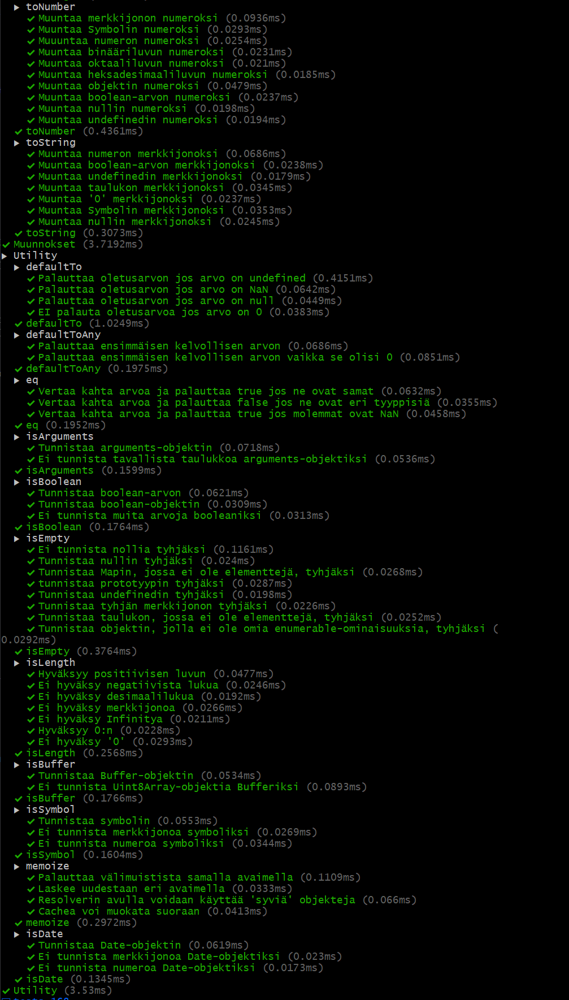
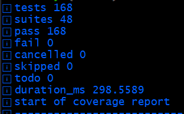

# Testaus, CI ja Coveralls

[](https://coveralls.io/github/Markus-Kivinen/AT00BY10-3012-deployment)

## Sisällysluettelo
- [Lähestymistapa ja toteutus](#lähestymistapa-ja-toteutus)
- [Ympäristö ja kirjastot](#ympäristö-ja-kirjastot)
- [Konfigurointi](#konfigurointi)
- [Komennot](#komennot)
- [GitHub Actions](#github-actions)
- [Testaus ja raportointi](#testaus-ja-raportointi)
- [Kattavuusraportit](#kattavuusraportit)
- [Lopullinen arvio tuotantovalmiudesta](#lopullinen-arvio-tuotantovalmiudesta)


## Lähestymistapa ja toteutus

Alkuperäinen projekti ei sisältänyt lainkaan lintteriä tai testejä, joten aloitin asentamalla ESLintin ja konfiguroimalla sen. Lähtötavoitteena oli muutaman perustestin tekeminen jokaiselle funktiolle.  

Kävin funktiot läpi aakkosjärjestyksessä, poissulkien ne funktiot jotka sijaitsevat .internal-kansiossa, koska ne on tarkoitettu vain kirjaston sisäiseen käyttöön.  
Aloitin luomalla yksikkötestit muutamalle ensimmäiselle funktiolle ja testasin testien ajamisen lokaalisti. Testien toiminnan varmistamisen jälkeen päätin että on aika ottaa käyttöön CI, jotta testit ja linttaus voidaan ajaa automaattisesti joka ikiselle pushille. Samalla konfiguroin lintterin poissulkemaan .internal-kansion, jotta se ei aiheuttaisi ylimääräisiä varoituksia.

Löysin ensimmäisen virheen jo ensimmäisten testien aikana, joten loin toistaiseksi `skip_known_bugs` muuttujan, jolla käytin tunnettujen virheiden ohittamiseen. Loin myös raportit jokaiselle löydetylle virheella/ongelmalle, sitä mukaa kun kohtasin ne.

Muutaman kymmenen funktion testauksen jälkeen päätin että on aika ottaa käyttöön kattavuusraportit, jotta näen missä funktioissa on vielä kattavuusongelmia. Asensin c8-kirjaston ja konfiguroin sen tuottamaan kattavuusraportit ja poissulkemaan .internal-kansion. Lisäsin vielä tämän vaiheen CI-työnkulun loppuun. Lisäsin myös badge:n README:hen näyttämään kattavuuden tason suoraan GitHubissa. Muutaman testin jälkeen muutin vielä työnkulun lähettämään kattavuusraportit Coverallsille, vaikka testit epäonnistuvaisitkin.

Kirjoitin lopuillekin funktioille testit. Kaikkien testien kirjoittamisen jälkeen päätin jakaa luodut testit useampaan tiedostoon ja kategorioida ne. Kaikkien testien ja raporttien luomisen jälkeen siirryin korjaamaan löydettyjä ongelmia, jotka testit paljastivat. Kaikkien ongelmien korjaamisen jälkeen poistin `skip_known_bugs` -muuttujan ja kaikki siihen liittyvät ohitukset, jotta testit ajaisivat kaikki funktiot läpi.

Lopulta päädyin vielä korvaamaan c8:n omalla skriptillä, joka ajaa testit ja luo vaadittavat tiedostot coverallsille, koska halusin välttää ylimääräisiä kirjastoja.
Skripti löytyy [scripts/run-coverage.js](scripts/run-coverage.js) -tiedostosta.

### Ympäristö ja kirjastot
- Node.js versio: 24.6.0
- NPM versio: 11.6.1  

Kehitys riippuvuudet:
- ESLint: 10.0.3
  * @eslint/js: 10.0.1
  * globals: 17.4.0

### Konfigurointi
- ESLint
    - Konfiguraatiotiedosto: [eslint.config.js](eslint.config.js)
    - Linttauskomento `npm run lint`
- coverage
    - Ajotiedosto (sis konfiguraatiot): [scripts/run-coverage.js](scripts/run-coverage.js)
    - Testikomento: `npm run coverage`

### Komennot
```bash
npm install
npm run test
npm run coverage
npm run lint
```
### GitHub Actions
- CI-Työnkulun tiedosto: `.github/workflows/ci.yml`
- Ajetaan joka ikiselle pushille
- Workflown vaiheet:
  - 1) linttaus
  - 2) testit ja kattavuusraportti.  
  kattavuusraportti lähetetään Coverallsille vaikka testit epäonnistuisivatkin.

[Actions](https://github.com/Markus-Kivinen/AT00BY10-3012-deployment/actions) -sivulta löytyy kaikki työnkulut ja niiden tulokset.

<details><summary>

### Kuvat workflowsta
</summary>


</details>


## Testaus ja raportointi
Testeissä keskityin testaamaan funktioiden perustoimintoja ja odottamattomia syötteitä. Testit kirjoitettiin käyttäen Node.js:n sisäänrakennettua testausmoduulia, joka oli aivan riittävä tähän projektiin.

Alkuun testejä oli tarkoitus kirjoittaa vain muutama per funktio, mutta funktion käyttäytyessä oudosti kirjoitin lisää testejä kattamaan erilaisia skenaarioita. Lisäsin myös testejä siinä tapauksessa että funktion coverage oli erityisen alhainen esim. < 80%.

Yhteensä testejä muodostui 168 kappaletta, joten lopuksi päätin jakaa ne vielä useampaan tiedostoon kategorioittain, jotta testit olisivat ylläpidettävämpiä.

### Testien suoritus 
Komento: `npm test

### Testitulokset
<details><summary>

#### Tekstinä
</summary>

```bash
$ npm test

> software-testing-assignment@1.0.0 test
> node --test

▶ Numeeriset funktiot
  ▶ add
    ✔ Laskee summan kahdelle luvulle (0.3293ms)
    ✔ Laskee summan kahdelle negatiivisella luvulle (0.091ms)
    ✔ Laskee summan yhdelle positiiviselle ja yhdelle negatiiviselle luvulle (0.1385ms)
  ✔ add (0.9429ms)
  ▶ divide
    ✔ Jakaa kaksi lukua (0.1389ms)
    ✔ Palauttaaa Infinity jakamalla nollalla (0.0532ms)
    ✔ Jakaa kaksi lukua, joissa toinen on desimaaliluku (0.0486ms)
    ✔ Jakaa kaksi negatiivista lukua (0.0496ms)
  ✔ divide (0.3963ms)
  ▶ ceil
    ✔ Pyöristää luvun ylöspäin (0.1298ms)
    ✔ Pyöristää luvun ylöspäin halutulla tarkkuudella (0.0796ms)
  ✔ ceil (0.3142ms)
  ▶ clamp
    ✔ Ei rajoita lukua turhaan (0.1113ms)
    ✔ Rajoittaa luvun alarajaan, jos se on pienempi kuin alaraja (0.057ms)
    ✔ Rajoittaa luvun ylärajaan, jos se on suurempi kuin yläraja (0.0556ms)
  ✔ clamp (0.2713ms)
✔ Numeeriset funktiot (2.6737ms)
▶ Objekti/taulukko funktiot
  ▶ at
    ✔ Palauttaa oikean elementin yksiulotteisesta taulukosta (0.7397ms)
    ✔ Palauttaa oikeat elementit yksiulotteisesta taulukosta (0.0726ms)
    ✔ Palauttaa oikean elementin yksiulotteisesta objektista (0.0528ms)
    ✔ Palauttaa oikeat elementit sisäkkäisestä objektissa (0.3491ms)
  ✔ at (1.6034ms)
  ▶ chunk
    ✔ Jakaa taulukon osiin (0.1974ms)
    ✔ Palauttaa tyhjän taulukon takaisin (0.0516ms)
  ✔ chunk (0.317ms)
  ▶ compact
    ✔ Poistaa 'valheelliset' arvot (0.1111ms)
  ✔ compact (0.1884ms)
  ▶ countBy
    ✔ Laskee elementtien määrän ryhmittäin (0.1411ms)
  ✔ countBy (0.184ms)
  ▶ difference
    ✔ Palauttaa arvot, jotka ovat ensimmäisessä taulukossa mutta ei toisessa (0.1387ms)
    ✔ Toimii vain referenssien perusteella (0.5198ms)
  ✔ difference (0.7079ms)
  ▶ drop
    ✔ Poistaa ensimmäisen elementin (0.1152ms)
    ✔ Poistaa määritetyn määrän elementtejä (0.0974ms)
    ✔ Ei poista mitään, jos n on 0 (0.0423ms)
    ✔ Poistaa kaikki elementit, jos n on suurempi kuin taulukon pituus (0.0261ms)
    ✔ Käsittelee negatiivisen n:n oikein (0.0274ms)
    ✔ Käsittelee tyhjän taulukon oikein (0.0188ms)
  ✔ drop (0.4466ms)
  ▶ every
    ✔ Tarkistaa että kaikki elementit täyttävät ehdon (0.0764ms)
    ✔ Tarkistaa että kaikki elementit eivät täytä ehtoa (0.0258ms)
    ✔ Tarkistaa että kaikki elementit täyttävät ehdon tyhjässä taulukossa (0.018ms)
  ✔ every (0.1651ms)
  ▶ filter
    ✔ Suodattaa taulukon elementit ehdon perusteella (0.0711ms)
    ✔ Palauttaa tyhjän taulukon, jos mikään elementti ei täytä ehtoa (0.0278ms)
    ✔ Palauttaa kaikki elementit, jos kaikki täyttävät ehdon (0.0439ms)
    ✔ Käsittelee tyhjän taulukon oikein (0.0824ms)
  ✔ filter (0.2878ms)
  ▶ get
    ✔ Hakee syvällä olevan arvon objektista merkkijonolla (0.0626ms)
    ✔ Hakee syvällä olevan arvon objektista taulukolla (0.0351ms)
    ✔ Palauttaa oletusarvon, jos arvo on undefined (0.0324ms)
  ✔ get (0.1696ms)
  ▶ isArrayLike
    ✔ Tunnistaa taulukkomaisen objektin (0.0626ms)
    ✔ Ei tunnista funktiota taulukkomaiseksi objektiksi (0.0298ms)
    ✔ Tunnistaa merkkijonon taulukkomaiseksi objektiksi (0.0194ms)
    ✔ Tunnistaa taulukon taulukkomaiseksi objektiksi (0.0296ms)
    ✔ Ei tunnista luokkaa taulukkomaiseksi objektiksi (0.0341ms)
  ✔ isArrayLike (0.2341ms)
  ▶ isArrayLikeObject
    ✔ Tunnistaa taulukkomaisen objektin (0.0457ms)
    ✔ Ei tunnista funktiota taulukkomaiseksi objektiksi (0.0232ms)
    ✔ Ei tunnista merkkijonoa taulukkomaiseksi objektiksi (0.02ms)
    ✔ Tunnistaa taulukon taulukkomaiseksi objektiksi (0.0219ms)
    ✔ Ei tunnista luokkaa taulukkomaiseksi objektiksi (0.0397ms)
  ✔ isArrayLikeObject (0.1958ms)
  ▶ isObject
    ✔ Tunnistaa objektin (0.099ms)
    ✔ Tunnistaa taulukon objektiksi (0.0309ms)
    ✔ Tunnistaa funktion objektiksi (0.0358ms)
    ✔ Ei tunnista nullia objektiksi (0.0168ms)
    ✔ Tunnistaa Number-objektin objektiksi (0.022ms)
    ✔ Tunnistaa String-objektin objektiksi (0.0227ms)
    ✔ Tunnistaa luokan objektiksi (0.0211ms)
  ✔ isObject (0.3182ms)
  ▶ isObjectLike
    ✔ Tunnistaa objektimaisen arvon (0.0387ms)
    ✔ Tunnistaa taulukomaisen objektin (0.0226ms)
    ✔ Ei tunnista funktiota objektimaiseksi (0.0192ms)
    ✔ Ei tunnista nullia objektimaiseksi (0.0173ms)
  ✔ isObjectLike (0.1471ms)
  ▶ isTypedArray
    ✔ Tunnistaa Uint8Array-objektin (0.1758ms)
    ✔ Tunnistaa Float32Array-objektin (0.096ms)
    ✔ Ei tunnista tavallista taulukkoa typed arrayksi (0.0327ms)
    ✔ Ei tunnista merkkijonoa typed arrayksi (0.0251ms)
    ✔ Ei tunnista tyhjää taulukkoa typed arrayksi (0.0159ms)
  ✔ isTypedArray (0.3998ms)
  ▶ keys
    ✔ Palauttaa objektin omat enumerable-ominaisuudet (0.0615ms)
    ✔ Ei palauta prototyypin ominaisuuksia (0.0402ms)
    ✔ Palauttaa taulukkomaiset objektit oikein (0.1187ms)
  ✔ keys (0.2548ms)
  ▶ map
    ✔ Muuttaa taulukon elementit iterateen avulla (0.0615ms)
    ✔ Muuttaa nullin taulukkomaiseksi objektiksi (0.023ms)
    ✔ Muuntaa tyhjän taulukkomaisen objektin (0.0193ms)
  ✔ map (0.1436ms)
  ▶ reduce
    ✔ Redusoi taulukon yhdeksi arvoksi (0.0337ms)
    ✔ Redusoi objektin yhdeksi arvoksi (0.0758ms)
    ✔ Redusoi ilman alku-arvoa (0.0221ms)
    ✔ Redusoi tyhjä taulukko ilman alku-arvoa (0.0185ms)
  ✔ reduce (0.1825ms)
  ▶ slice
    ✔ Leikkaa taulukon osaksi (0.0386ms)
    ✔ Leikkaa taulukon osaksi alkaen indeksistä (0.0245ms)
    ✔ Rajoittaa indeksit taulukon pituuteen (0.0165ms)
    ✔ Palauttaa tyhjän taulukon takaisin (0.0741ms)
    ✔ Klamppaa indeksit (0.0377ms)
    ✔ Leikkaa taulukon osaksi alkaen indeksistä ja päättyen loppuun (0.0199ms)
  ✔ slice (0.7286ms)
  ▶ words
    ✔ Jakaa merkkijonon sanoiksi (0.1741ms)
    ✔ Käsittelee emojin oikein (0.1207ms)
    ✔ Käsittelee yksittäisen sanan oikein (0.0467ms)
    ✔ Jakaa merkkijonon sanoiksi käyttäen mukautettua mallia (0.028ms)
    ✔ Käsittelee tyhjän merkkijonon oikein (0.0195ms)
    ✔ Kontrollimerkki ohittaa ascii-polun (0.017ms)
  ✔ words (0.4587ms)
✔ Objekti/taulukko funktiot (7.6895ms)
▶ Tekstinkäsittely
  ▶ camelCase
    ✔ Muuttaa merkkijonon kameliksi (0.4727ms)
  ✔ camelCase (0.8388ms)
  ▶ upperfirst
    ✔ Muuttaa merkkijonon ensimmäisen kirjaimen isoksi (0.5057ms)
    ✔ Ei tee mitään jos merkkijono on tyhjä (0.0826ms)
    ✔ Ei kaadu väärällä tyypillä (0.0838ms)
  ✔ upperfirst (0.7655ms)
  ▶ capitalize
    ✔ Muuttaa merkkijonon ensimmäisen kirjaimen suureksi (0.0719ms)
    ✔ Ei tee mitään jos merkkijono on tyhjä (0.0509ms)
    ✔ Ei kaadu väärällä tyypillä (0.049ms)
  ✔ capitalize (0.2602ms)
  ▶ endsWith
    ✔ Tarkistaa että merkkijono päättyy annettuun merkkijonoon (0.0883ms)
    ✔ rajoittaa indeksin (0.0776ms)
    ✔ Tarkistaa että merkkijono päättyy annettuun merkkijonoon halutussa positiossa (0.1447ms)
    ✔ Tarkistaa että merkkijono ei pääty annettuun merkkijonoon (0.0799ms)
  ✔ endsWith (0.4821ms)
✔ Tekstinkäsittely (2.6191ms)
▶ Muunnokset
  ▶ castArray
    ✔ Muuntaa luvun taulukoksi (0.8825ms)
    ✔ Ei muuta taulukkoa (0.1114ms)
    ✔ Muuntaa merkkijonon taulukoksi (0.0687ms)
    ✔ Muuntaa nullin taulukoksi (0.0882ms)
    ✔ Muuntaa ilman argumentteja taulukoksi (0.0745ms)
    ✔ Palauttaa saman taulukon (0.5477ms)
  ✔ castArray (2.3378ms)
  ▶ toFinite
    ✔ Muuntaa luvun finitiiviseksi (0.1816ms)
    ✔ Muuntaa Number.MIN_VALUE:n finitiiviseksi (0.0696ms)
    ✔ Muuntaa Infinity finitiiviseksi (0.0543ms)
    ✔ Muuntaa merkkijonon finitiiviseksi (0.2512ms)
  ✔ toFinite (0.692ms)
  ▶ toInteger
    ✔ Muuntaa desimaaliluvun kokonaisluvuksi (0.0891ms)
    ✔ Muuntaa negatiivisen desimaaliluvun kokonaisluvuksi (0.0288ms)
    ✔ Muuntaa merkkijonon kokonaisluvuksi (0.075ms)
  ✔ toInteger (0.2415ms)
  ▶ toNumber
    ✔ Muuntaa merkkijonon numeroksi (0.0899ms)
    ✔ Muuntaa Symbolin numeroksi (0.0244ms)
    ✔ Muuuntaa numeron numeroksi (0.0202ms)
    ✔ Muuntaa binääriluvun numeroksi (0.026ms)
    ✔ Muuntaa oktaaliluvun numeroksi (0.0176ms)
    ✔ Muuntaa heksadesimaaliluvun numeroksi (0.0241ms)
    ✔ Muuntaa objektin numeroksi (0.0407ms)
    ✔ Muuntaa boolean-arvon numeroksi (0.0226ms)
    ✔ Muuntaa nullin numeroksi (0.0184ms)
    ✔ Muuntaa undefinedin numeroksi (0.0167ms)
  ✔ toNumber (0.3768ms)
  ▶ toString
    ✔ Muuntaa numeron merkkijonoksi (0.0915ms)
    ✔ Muuntaa boolean-arvon merkkijonoksi (0.0237ms)
    ✔ Muuntaa undefinedin merkkijonoksi (0.0165ms)
    ✔ Muuntaa taulukon merkkijonoksi (0.0267ms)
    ✔ Muuntaa '0' merkkijonoksi (0.0175ms)
    ✔ Muuntaa Symbolin merkkijonoksi (0.0289ms)
    ✔ Muuntaa nullin merkkijonoksi (0.0171ms)
  ✔ toString (0.2956ms)
✔ Muunnokset (4.3029ms)
▶ Utility
  ▶ defaultTo
    ✔ Palauttaa oletusarvon jos arvo on undefined (0.3407ms)
    ✔ Palauttaa oletusarvon jos arvo on NaN (0.0801ms)
    ✔ Palauttaa oletusarvon jos arvo on null (0.0483ms)
    ✔ EI palauta oletusarvoa jos arvo on 0 (0.0534ms)
  ✔ defaultTo (0.9735ms)
  ▶ defaultToAny
    ✔ Palauttaa ensimmäisen kelvollisen arvon (0.0851ms)
    ✔ Palauttaa ensimmäisen kelvollisen arvon vaikka se olisi 0 (0.0793ms)
  ✔ defaultToAny (0.2727ms)
  ▶ eq
    ✔ Vertaa kahta arvoa ja palauttaa true jos ne ovat samat (0.1805ms)
    ✔ Vertaa kahta arvoa ja palauttaa false jos ne ovat eri tyyppisiä (0.1151ms)
    ✔ Vertaa kahta arvoa ja palauttaa true jos molemmat ovat NaN (0.0589ms)
  ✔ eq (0.5484ms)
  ▶ isArguments
    ✔ Tunnistaa arguments-objektin (0.1157ms)
    ✔ Ei tunnista tavallista taulukkoa arguments-objektiksi (0.0457ms)
  ✔ isArguments (0.21ms)
  ▶ isBoolean
    ✔ Tunnistaa boolean-arvon (0.0859ms)
    ✔ Tunnistaa boolean-objektin (0.0276ms)
    ✔ Ei tunnista muita arvoja booleaniksi (0.0252ms)
  ✔ isBoolean (0.1886ms)
  ▶ isEmpty
    ✔ Tunnistaa luvut tyhjäksi (0.1525ms)
    ✔ Tunnistaa nullin tyhjäksi (0.0357ms)
    ✔ Tunnistaa Mapin, jossa ei ole elementtejä, tyhjäksi (0.0474ms)
    ✔ tunnistaa prototyypin tyhjäksi (0.052ms)
    ✔ Tunnistaa undefinedin tyhjäksi (0.0231ms)
    ✔ Tunnistaa tyhjän merkkijonon tyhjäksi (0.0284ms)
    ✔ Tunnistaa taulukon, jossa ei ole elementtejä, tyhjäksi (0.0225ms)
    ✔ Tunnistaa objektin, jolla ei ole omia enumerable-ominaisuuksia, tyhjäksi (0.0332ms)
  ✔ isEmpty (0.4673ms)
  ▶ isLength
    ✔ Hyväksyy positiivisen luvun (0.0412ms)
    ✔ Ei hyväksy negatiivista lukua (0.0212ms)
    ✔ Ei hyväksy desimaalilukua (0.0176ms)
    ✔ Ei hyväksy merkkijonoa (0.0239ms)
    ✔ Ei hyväksy Infinitya (0.0177ms)
    ✔ Hyväksyy 0:n (0.0198ms)
    ✔ Ei hyväksy '0' (0.0288ms)
  ✔ isLength (0.227ms)
  ▶ isBuffer
    ✔ Tunnistaa Buffer-objektin (0.0498ms)
    ✔ Ei tunnista Uint8Array-objektia Bufferiksi (0.0459ms)
  ✔ isBuffer (0.1326ms)
  ▶ isSymbol
    ✔ Tunnistaa symbolin (0.0545ms)
    ✔ Ei tunnista merkkijonoa symboliksi (0.0185ms)
    ✔ Ei tunnista numeroa symboliksi (0.0158ms)
  ✔ isSymbol (0.1173ms)
  ▶ memoize
    ✔ Palauttaa välimuistista samalla avaimella (0.1016ms)
    ✔ Laskee uudestaan eri avaimella (0.038ms)
    ✔ Resolverin avulla voidaan käyttää 'syviä' objekteja (0.0596ms)
    ✔ Cachea voi muokata suoraan (0.0344ms)
  ✔ memoize (0.3365ms)
  ▶ isDate
    ✔ Tunnistaa Date-objektin (0.0526ms)
    ✔ Ei tunnista merkkijonoa Date-objektiksi (0.0327ms)
    ✔ Ei tunnista numeroa Date-objektiksi (0.0871ms)
  ✔ isDate (0.2172ms)
✔ Utility (4.2406ms)
ℹ tests 168
ℹ suites 48
ℹ pass 168
ℹ fail 0
ℹ cancelled 0
ℹ skipped 0
ℹ todo 0
ℹ duration_ms 96.2448
```

</details>

<details><summary>

#### Kuvina
</summary>





</details>
<br>

### Virhe/Ongelma-raportit

Testeissä löytyi useita ongelmia, joista jokaisesta luotiin raportti GitHubiin.  
Yhteensä löydettiin:
* 12 Korjattavaa virhettä, [Virhe-raportit](https://github.com/Markus-Kivinen/AT00BY10-3012-deployment/issues?q=is%3Aissue%20state%3Aclosed%20label%3Abug)
* 29 korjattavissa olevaa eqeqeq-varoitusta ESLintiltä, katso [issue #10](https://github.com/Markus-Kivinen/AT00BY10-3012-deployment/issues/10) ja [issue #1](https://github.com/Markus-Kivinen/AT00BY10-3012-deployment/issues/1)
* 1 ohitettava `no-control-regex`-varoitus ESLintiltä, katso [issue #14](https://github.com/Markus-Kivinen/AT00BY10-3012-deployment/issues/14)
* 2 paranneltavaa funktiota, katso [enhancement-raportit](https://github.com/Markus-Kivinen/AT00BY10-3012-deployment/issues?q=is%3Aissue%20state%3Aclosed%20label%3Aenhancement)

## Kattavuusraportit
Täysi kattavuusraportti saatavissa readme.MD:n alussa olevan badgen kautta tai suoraan [tästä](https://coveralls.io/github/Markus-Kivinen/AT00BY10-3012-deployment) linkistä.

### Kattavuusraportin ajo
Komento: `npm run coverage`  
Ajo-komento suorittaa scriptin `scripts/run-coverage.js`, joka sisältää myös tarvittavat konfiguraatiot.

### Kattavuusraportti
Kattavuus

- 1437 of 1440 relevant lines covered (99.79%)
- 214 of 246 branches covered (86.99%)

Alla on esimerkki tulostus `npm run coverage` -komennosta:
<details><summary>
#### Kattavuusraportti tekstinä

</summary>

```bash
ℹ start of coverage report
ℹ ------------------------------------------------------------------------
ℹ file                    | line % | branch % | funcs % | uncovered lines
ℹ ------------------------------------------------------------------------
ℹ src                     |        |          |         |
ℹ  add.js                 | 100.00 |   100.00 |  100.00 |
ℹ  at.js                  | 100.00 |   100.00 |  100.00 |
ℹ  camelCase.js           | 100.00 |   100.00 |  100.00 |
ℹ  capitalize.js          | 100.00 |   100.00 |  100.00 |
ℹ  castArray.js           | 100.00 |   100.00 |  100.00 |
ℹ  ceil.js                | 100.00 |   100.00 |  100.00 |
ℹ  chunk.js               | 100.00 |    83.33 |  100.00 |
ℹ  clamp.js               | 100.00 |    75.00 |  100.00 |
ℹ  compact.js             | 100.00 |   100.00 |  100.00 |
ℹ  countBy.js             | 100.00 |   100.00 |  100.00 |
ℹ  defaultTo.js           | 100.00 |   100.00 |  100.00 |
ℹ  defaultToAny.js        | 100.00 |   100.00 |  100.00 |
ℹ  difference.js          | 100.00 |    66.67 |  100.00 |
ℹ  divide.js              | 100.00 |   100.00 |  100.00 |
ℹ  drop.js                | 100.00 |    85.71 |  100.00 |
ℹ  endsWith.js            | 100.00 |   100.00 |  100.00 |
ℹ  eq.js                  | 100.00 |   100.00 |  100.00 |
ℹ  every.js               | 100.00 |    83.33 |  100.00 |
ℹ  filter.js              | 100.00 |    80.00 |  100.00 |
ℹ  get.js                 | 100.00 |    80.00 |  100.00 |
ℹ  isArguments.js         | 100.00 |   100.00 |  100.00 |
ℹ  isArrayLike.js         | 100.00 |   100.00 |  100.00 |
ℹ  isArrayLikeObject.js   | 100.00 |   100.00 |  100.00 |
ℹ  isBoolean.js           | 100.00 |   100.00 |  100.00 |
ℹ  isBuffer.js            | 100.00 |    33.33 |    0.00 |
ℹ  isDate.js              | 100.00 |    60.00 |   50.00 |
ℹ  isEmpty.js             | 100.00 |    78.95 |  100.00 |
ℹ  isLength.js            | 100.00 |   100.00 |  100.00 |
ℹ  isObject.js            | 100.00 |   100.00 |  100.00 |
ℹ  isObjectLike.js        | 100.00 |   100.00 |  100.00 |
ℹ  isSymbol.js            | 100.00 |   100.00 |  100.00 |
ℹ  isTypedArray.js        | 100.00 |    60.00 |   50.00 |
ℹ  keys.js                | 100.00 |   100.00 |  100.00 |
ℹ  map.js                 | 100.00 |   100.00 |  100.00 |
ℹ  filter.js              | 100.00 |    80.00 |  100.00 |
ℹ  get.js                 | 100.00 |    80.00 |  100.00 |
ℹ  isArguments.js         | 100.00 |   100.00 |  100.00 |
ℹ  isArrayLike.js         | 100.00 |   100.00 |  100.00 |
ℹ  isArrayLikeObject.js   | 100.00 |   100.00 |  100.00 |
ℹ  isBoolean.js           | 100.00 |   100.00 |  100.00 |
ℹ  isBuffer.js            | 100.00 |    33.33 |    0.00 |
ℹ  isDate.js              | 100.00 |    60.00 |   50.00 |
ℹ  isEmpty.js             | 100.00 |    78.95 |  100.00 |
ℹ  isLength.js            | 100.00 |   100.00 |  100.00 |
ℹ  isObject.js            | 100.00 |   100.00 |  100.00 |
ℹ  isObjectLike.js        | 100.00 |   100.00 |  100.00 |
ℹ  isSymbol.js            | 100.00 |   100.00 |  100.00 |
ℹ  isTypedArray.js        | 100.00 |    60.00 |   50.00 |
ℹ  keys.js                | 100.00 |   100.00 |  100.00 |
ℹ  filter.js              | 100.00 |    80.00 |  100.00 |
ℹ  get.js                 | 100.00 |    80.00 |  100.00 |
ℹ  isArguments.js         | 100.00 |   100.00 |  100.00 |
ℹ  isArrayLike.js         | 100.00 |   100.00 |  100.00 |
ℹ  isArrayLikeObject.js   | 100.00 |   100.00 |  100.00 |
ℹ  isBoolean.js           | 100.00 |   100.00 |  100.00 |
ℹ  isBuffer.js            | 100.00 |    33.33 |    0.00 |
ℹ  isDate.js              | 100.00 |    60.00 |   50.00 |
ℹ  isEmpty.js             | 100.00 |    78.95 |  100.00 |
ℹ  isLength.js            | 100.00 |   100.00 |  100.00 |
ℹ  isObject.js            | 100.00 |   100.00 |  100.00 |
ℹ  isObjectLike.js        | 100.00 |   100.00 |  100.00 |
ℹ  filter.js              | 100.00 |    80.00 |  100.00 |
ℹ  get.js                 | 100.00 |    80.00 |  100.00 |
ℹ  isArguments.js         | 100.00 |   100.00 |  100.00 |
ℹ  isArrayLike.js         | 100.00 |   100.00 |  100.00 |
ℹ  isArrayLikeObject.js   | 100.00 |   100.00 |  100.00 |
ℹ  isBoolean.js           | 100.00 |   100.00 |  100.00 |
ℹ  isBuffer.js            | 100.00 |    33.33 |    0.00 |
ℹ  isDate.js              | 100.00 |    60.00 |   50.00 |
ℹ  isEmpty.js             | 100.00 |    78.95 |  100.00 |
ℹ  isLength.js            | 100.00 |   100.00 |  100.00 |
ℹ  filter.js              | 100.00 |    80.00 |  100.00 |
ℹ  get.js                 | 100.00 |    80.00 |  100.00 |
ℹ  isArguments.js         | 100.00 |   100.00 |  100.00 |
ℹ  isArrayLike.js         | 100.00 |   100.00 |  100.00 |
ℹ  isArrayLikeObject.js   | 100.00 |   100.00 |  100.00 |
ℹ  isBoolean.js           | 100.00 |   100.00 |  100.00 |
ℹ  isBuffer.js            | 100.00 |    33.33 |    0.00 |
ℹ  isDate.js              | 100.00 |    60.00 |   50.00 |
ℹ  filter.js              | 100.00 |    80.00 |  100.00 |
ℹ  get.js                 | 100.00 |    80.00 |  100.00 |
ℹ  isArguments.js         | 100.00 |   100.00 |  100.00 |
ℹ  isArrayLike.js         | 100.00 |   100.00 |  100.00 |
ℹ  isArrayLikeObject.js   | 100.00 |   100.00 |  100.00 |
ℹ  isBoolean.js           | 100.00 |   100.00 |  100.00 |
ℹ  filter.js              | 100.00 |    80.00 |  100.00 |
ℹ  get.js                 | 100.00 |    80.00 |  100.00 |
ℹ  isArguments.js         | 100.00 |   100.00 |  100.00 |
ℹ  isArrayLike.js         | 100.00 |   100.00 |  100.00 |
ℹ  filter.js              | 100.00 |    80.00 |  100.00 |
ℹ  get.js                 | 100.00 |    80.00 |  100.00 |
ℹ  isArguments.js         | 100.00 |   100.00 |  100.00 |
ℹ  isArrayLike.js         | 100.00 |   100.00 |  100.00 |
ℹ  isArrayLikeObject.js   | 100.00 |   100.00 |  100.00 |
ℹ  filter.js              | 100.00 |    80.00 |  100.00 |
ℹ  get.js                 | 100.00 |    80.00 |  100.00 |
ℹ  isArguments.js         | 100.00 |   100.00 |  100.00 |
ℹ  isArrayLike.js         | 100.00 |   100.00 |  100.00 |
ℹ  filter.js              | 100.00 |    80.00 |  100.00 |
ℹ  get.js                 | 100.00 |    80.00 |  100.00 |
ℹ  isArguments.js         | 100.00 |   100.00 |  100.00 |
ℹ  filter.js              | 100.00 |    80.00 |  100.00 |
ℹ  get.js                 | 100.00 |    80.00 |  100.00 |
ℹ  isArguments.js         | 100.00 |   100.00 |  100.00 |
ℹ  isArrayLike.js         | 100.00 |   100.00 |  100.00 |
ℹ  isArrayLikeObject.js   | 100.00 |   100.00 |  100.00 |
ℹ  filter.js              | 100.00 |    80.00 |  100.00 |
ℹ  get.js                 | 100.00 |    80.00 |  100.00 |
ℹ  filter.js              | 100.00 |    80.00 |  100.00 |
ℹ  get.js                 | 100.00 |    80.00 |  100.00 |
ℹ  isArguments.js         | 100.00 |   100.00 |  100.00 |
ℹ  filter.js              | 100.00 |    80.00 |  100.00 |
ℹ  get.js                 | 100.00 |    80.00 |  100.00 |
ℹ  isArguments.js         | 100.00 |   100.00 |  100.00 |
ℹ  filter.js              | 100.00 |    80.00 |  100.00 |
ℹ  get.js                 | 100.00 |    80.00 |  100.00 |
ℹ  isArguments.js         | 100.00 |   100.00 |  100.00 |
ℹ  isArrayLike.js         | 100.00 |   100.00 |  100.00 |
ℹ  filter.js              | 100.00 |    80.00 |  100.00 |
ℹ  get.js                 | 100.00 |    80.00 |  100.00 |
ℹ  isArguments.js         | 100.00 |   100.00 |  100.00 |
ℹ  isArrayLike.js         | 100.00 |   100.00 |  100.00 |
ℹ  isArrayLikeObject.js   | 100.00 |   100.00 |  100.00 |
ℹ  isBoolean.js           | 100.00 |   100.00 |  100.00 |
ℹ  filter.js              | 100.00 |    80.00 |  100.00 |
ℹ  get.js                 | 100.00 |    80.00 |  100.00 |
ℹ  isArguments.js         | 100.00 |   100.00 |  100.00 |
ℹ  isArrayLike.js         | 100.00 |   100.00 |  100.00 |
ℹ  isArrayLikeObject.js   | 100.00 |   100.00 |  100.00 |
ℹ  isBoolean.js           | 100.00 |   100.00 |  100.00 |
ℹ  isArguments.js         | 100.00 |   100.00 |  100.00 |
ℹ  isArrayLike.js         | 100.00 |   100.00 |  100.00 |
ℹ  isArrayLikeObject.js   | 100.00 |   100.00 |  100.00 |
ℹ  isArrayLike.js         | 100.00 |   100.00 |  100.00 |
ℹ  isArrayLikeObject.js   | 100.00 |   100.00 |  100.00 |
ℹ  isArrayLikeObject.js   | 100.00 |   100.00 |  100.00 |
ℹ  isBoolean.js           | 100.00 |   100.00 |  100.00 |
ℹ  isBuffer.js            | 100.00 |    33.33 |    0.00 |
ℹ  isDate.js              | 100.00 |    60.00 |   50.00 |
ℹ  isEmpty.js             | 100.00 |    78.95 |  100.00 |
ℹ  isLength.js            | 100.00 |   100.00 |  100.00 |
ℹ  isObject.js            | 100.00 |   100.00 |  100.00 |
ℹ  isObjectLike.js        | 100.00 |   100.00 |  100.00 |
ℹ  isSymbol.js            | 100.00 |   100.00 |  100.00 |
ℹ  isTypedArray.js        | 100.00 |    60.00 |   50.00 |
ℹ  keys.js                | 100.00 |   100.00 |  100.00 |
ℹ  map.js                 | 100.00 |   100.00 |  100.00 |
ℹ  memoize.js             |  96.88 |    72.73 |  100.00 | 45-46
ℹ  reduce.js              | 100.00 |   100.00 |  100.00 |
ℹ  slice.js               |  98.08 |    81.82 |  100.00 | 36
ℹ  toFinite.js            | 100.00 |    87.50 |  100.00 |
ℹ  toInteger.js           | 100.00 |   100.00 |  100.00 |
ℹ  toNumber.js            | 100.00 |    83.33 |  100.00 |
ℹ  toString.js            | 100.00 |    84.62 |  100.00 |
ℹ  upperFirst.js          | 100.00 |   100.00 |  100.00 |
ℹ  words.js               | 100.00 |    88.89 |  100.00 |
ℹ ------------------------------------------------------------------------
ℹ all files               |  99.79 |    86.99 |   93.88 |
ℹ ------------------------------------------------------------------------
ℹ end of coverage report
```
</details>

## Lopullinen arvio tuotantovalmiudesta

Alkuperäinen kirjasto oli täysin testaamaton ja linttaamaton, joten se ei ollut tuotantovalmiudessa laisinkaan. Se sisälsi myös huomattavan määrän erilaisia ongelmia, jotka olisivat varmasti aiheuttaneet ongelmia.

Löydettyjen ongelmien korjaamisen jälkeen kirjaston line coverage on erinomaisella tasolla, mutta branch coverage on vielä hieman vajaa, joten on mahdollista että joitain reittejä ei ole vielä testattu riittävästi. Tästä huolimatta uskon että kirjastoa voisi nyt käyttää tuotannossa, mutta pienellä varauksella.  
